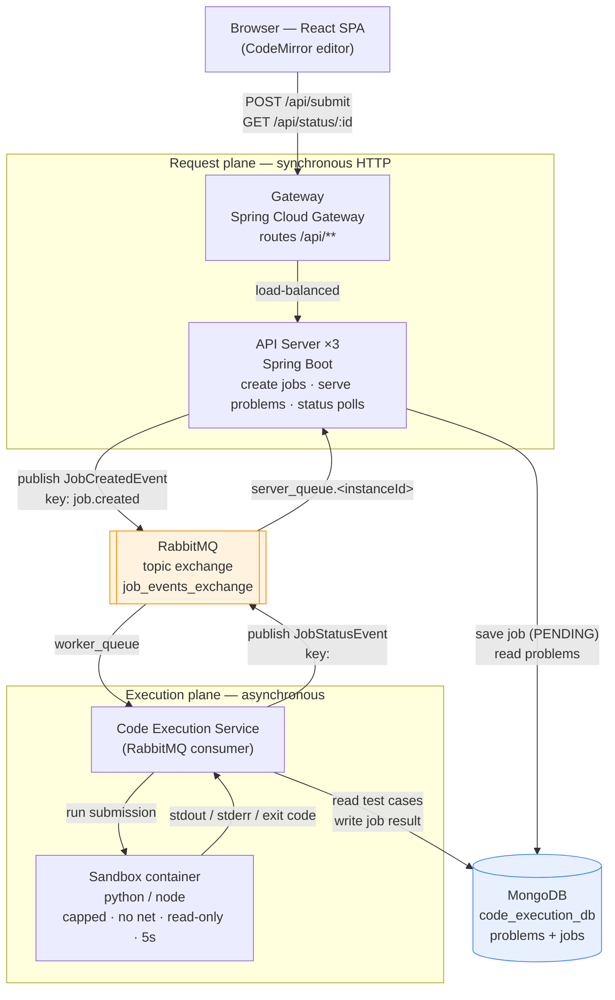
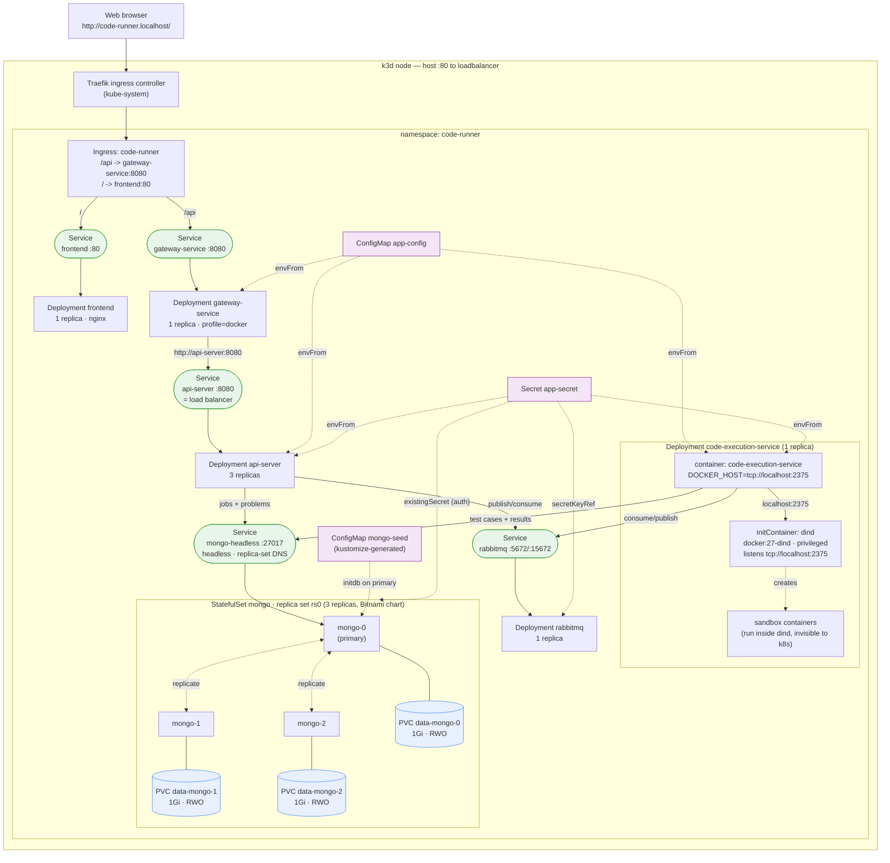
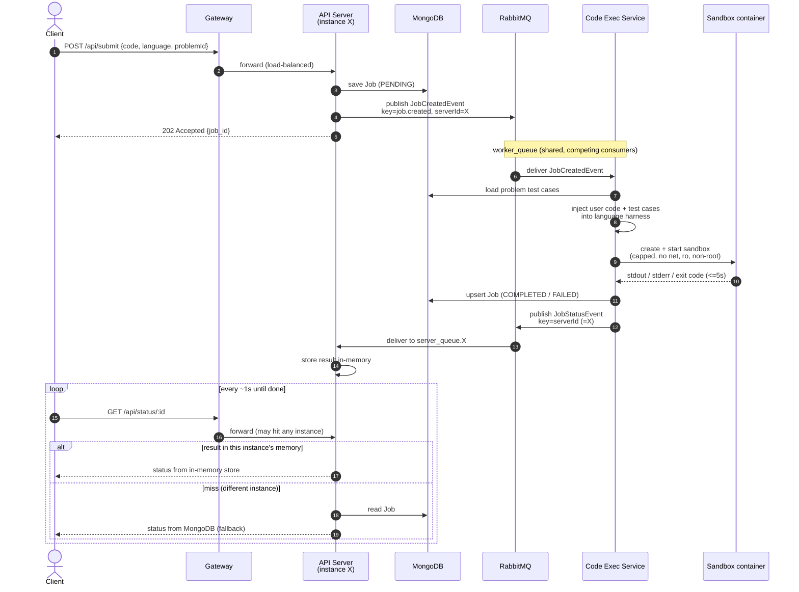
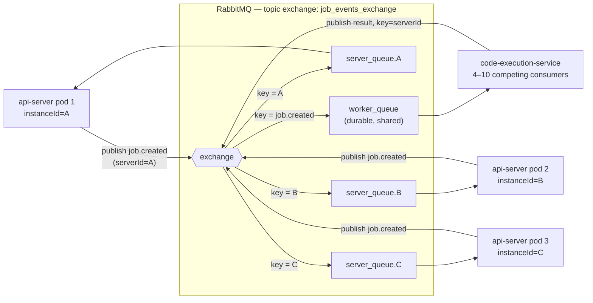
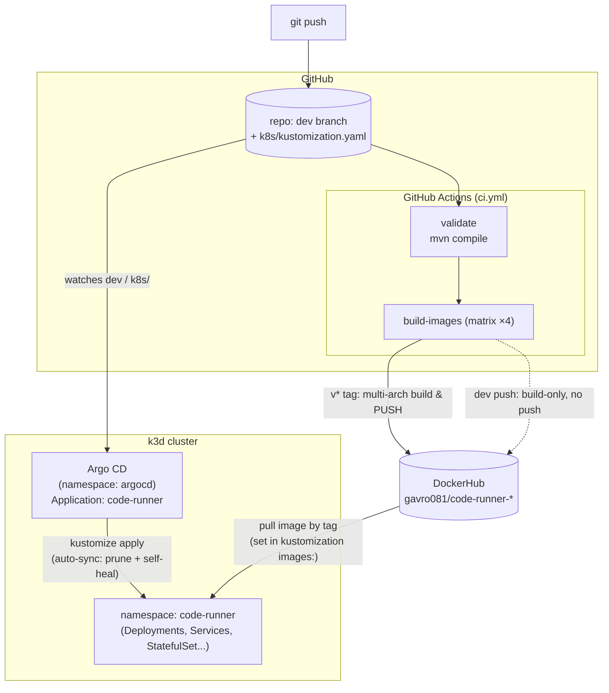

# Code Runner — Diagrams (draft)

Scratch file for reviewing the new Mermaid diagrams before they go into the README.
GitHub renders these blocks natively. Nothing here is committed yet.

---

## 1. High-level architecture (two planes)

Shows the split between the synchronous request plane (HTTP) and the
asynchronous execution plane (messaging), with the single MongoDB as the
shared store.

---

## 2. Kubernetes deployment topology (the object view)

Everything lives in the `code-runner` namespace. Traefik (the k3d-bundled
ingress controller) is cluster-scoped. Shows every workload, Service,
config object, and the PVC — plus the dind-sidecar nesting.

---

## 3. Submission flow (sequence)

The full lifecycle of one code submission, including the per-instance
reply-queue trick and the in-memory/Mongo fallback on status polls.

---

## 4. Messaging model (why one exchange, two queue kinds)

Zoom-in on the RabbitMQ routing: fan-in to the worker via a shared queue,
point-to-point reply back to the originating API server via per-instance queues.

---

## 5. CI/CD — GitOps delivery

How an image gets from a git push to running in the cluster. Argo CD lives
outside the app namespace and reconciles `k8s/` from the `dev` branch.

