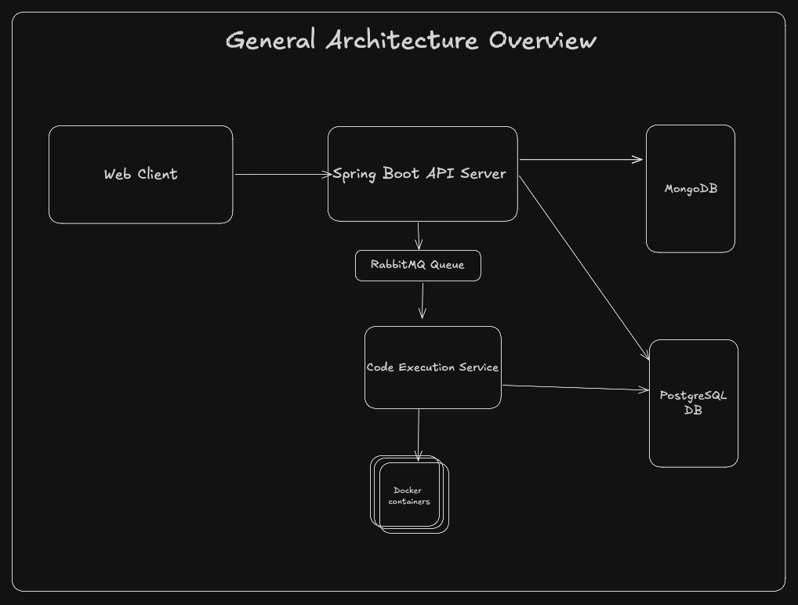
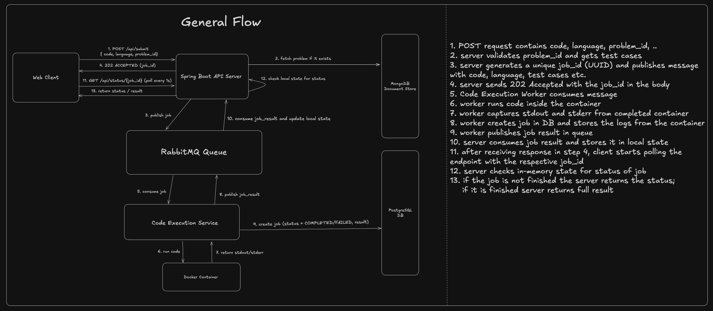

# Code Runner

A web platform where you solve coding problems and get instant feedback - code runs in sandboxed Docker containers on the backend.

## Architecture



| Component                  | Description                                                                                                                            |
| -------------------------- | -------------------------------------------------------------------------------------------------------------------------------------- |
| **Frontend**               | React app with a CodeMirror editor, light/dark theme, and resizable panels                                                             |
| **Gateway**                | Spring Cloud Gateway that load-balances (round-robin) across 3 API Server instances                                                    |
| **API Server**             | Handles problems, code submissions, and job status polling; publishes jobs to RabbitMQ                                                 |
| **Code Execution Service** | Consumes jobs from the queue, injects user code into a language-specific test harness, and runs it inside a sandboxed Docker container |
| **Common**                 | Shared library (DTOs, JPA entities, RabbitMQ constants) used by the other backend modules                                              |
| **RabbitMQ**               | Message broker — carries job events between the API Server and the execution worker                                                    |
| **PostgreSQL**             | Stores job records (status, stdout, stderr)                                                                                            |
| **MongoDB**                | Stores coding problems, test cases, and starter templates (read-only at runtime)                                                       |

### Ports

| Port        | Service                    |
| ----------- | -------------------------- |
| `5173`      | Frontend (Vite dev server) |
| `8080`      | Gateway                    |
| `8081–8083` | API Server (3 instances)   |
| `8084`      | Code Execution Service     |
| `5672`      | RabbitMQ (AMQP)            |
| `15672`     | RabbitMQ Management UI     |
| `5432`      | PostgreSQL                 |
| `27017`     | MongoDB                    |

## How it works



1. The client sends a `POST /api/submit` with the code, language, and problem ID
2. The API Server saves a `PENDING` job to Postgres, publishes a `JobCreatedEvent` to the RabbitMQ code-execution queue, and immediately returns `202 Accepted` with a `job_id`
3. The client starts polling `GET /api/status/{job_id}` every second
4. The Code Execution Service picks up the event, fetches the problem's test cases from MongoDB, loads the matching harness template (`python-harness.py` or `js-harness.js`), and injects the user's code + test cases into it
5. The composed script runs inside a throwaway Docker container (`python:3.10-slim` / `node:18-slim`) with strict limits:
   - 100 MB memory, no swap
   - 0.5 CPU cores, 50 PIDs max
   - No network access, read-only filesystem
   - Non-root user, 5-second timeout
6. stdout/stderr are captured, the job is persisted to Postgres as `COMPLETED` or `FAILED`, and a `JobResultEvent` is routed back to the originating API Server instance via its per-instance RabbitMQ reply queue
7. The next poll from the client picks up the finished result

The execution service auto-scales its RabbitMQ consumers (4–10 threads) and pauses consumption when system CPU exceeds 85%.

## Getting started

### Prerequisites

- Java 17+
- Node.js 18+
- Docker & Docker Compose
- PostgreSQL and MongoDB running locally

### Setup

**1. Clone and configure**

```bash
git clone https://github.com/gavro081/code-runner.git
cd code-runner
```

Copy the example config files and fill in your database credentials:

```bash
cp api-server/src/main/resources/application-example.properties \
   api-server/src/main/resources/application.properties

cp code-execution-service/src/main/resources/application-example.properties \
   code-execution-service/src/main/resources/application.properties
```

**2. Create the databases and seed problem data**

```sql
-- PostgreSQL
CREATE DATABASE code_runner_db;
```

Seed MongoDB with the included problem set:

```bash
chmod +x seed-db.sh
./seed-db.sh
```

This imports the problems from `code_execution_db.problems.json` into the `code_execution_db.problems` collection. Requires [MongoDB Database Tools](https://www.mongodb.com/docs/database-tools/installation/) (`mongoimport`).

**3. Start everything**

```bash
chmod +x start.sh
./start.sh
```

This single script:

- Frees ports `8080–8083` and `5173`
- Starts RabbitMQ via Docker Compose
- Builds and launches the gateway, 3 API server instances, and the execution service
- Installs frontend dependencies and starts the Vite dev server
- Waits for all services to be healthy before printing a ready message

Once running, open [http://localhost:5173](http://localhost:5173).

You can verify all ports with:

```bash
./check-ports.sh
```

## Load testing

The `commands/` directory has scripts for hammering the submission endpoint — useful for observing consumer auto-scaling and parallel job processing.

> **Note:** These scripts require tools that aren't installed by default on most systems.
> Install them first:
>
> ```bash
> # macOS
> brew install hey
> # ab (Apache Bench) ships with macOS via Apache, but on Linux:
> sudo apt install apache2-utils   # Debian/Ubuntu
> ```

```bash
cd commands

# Burst: 100 requests, 20 concurrent (Apache Bench)
./command1.sh

# Sustained: 100 requests, 25 concurrent (hey)
./command2.sh

# Continuous flood (loops command2 forever)
./command3.sh
```

Pass a custom request count as the first argument: `./command1.sh 500`

### Monitoring with RabbitMQ Management

While the load test is running, open the RabbitMQ Management UI at [http://localhost:15672](http://localhost:15672) (login: `guest` / `guest`).

- **Queues tab** — watch the `worker_queue` message rate spike as jobs flood in, and observe `Unacked` messages (currently being processed by consumers)
- **Channels tab** — see new consumer channels spin up in real-time as Spring AMQP auto-scales from 4 to 10 concurrent consumers under load; when the load drops, idle consumers shut down after ~10 seconds

## Project structure

```
api-server/                  # REST API + job creation (runs 3 instances)
code-execution-service/      # Worker: Docker-based sandboxed execution
  └─ src/main/resources/
      ├─ docker/             # Dockerfiles for Python & JS runner images
      └─ templates/          # Test harness templates (python-harness.py, js-harness.js)
gateway-service/             # Spring Cloud Gateway + load balancer
common/                      # Shared models, events, and RabbitMQ config
frontend/                    # React + Vite + CodeMirror + Tailwind CSS
commands/                    # Load testing scripts (ab, hey)
diagrams/                    # Architecture & flow diagrams
docker-compose.yml           # RabbitMQ container
code_execution_db.problems.json  # Problem seed data for MongoDB
seed-db.sh                   # Seeds MongoDB with the problem data
start.sh                     # One-command startup for everything
check-ports.sh               # Quick health check for all service ports
```

## Tech stack

| Layer     | Tech                                                           |
| --------- | -------------------------------------------------------------- |
| Frontend  | React 19, TypeScript, Vite, Tailwind CSS, CodeMirror           |
| Gateway   | Spring Cloud Gateway, Spring Cloud LoadBalancer                |
| API       | Spring Boot, Spring Data JPA, Spring Data MongoDB, Spring AMQP |
| Execution | Docker Java SDK, sandboxed containers                          |
| Messaging | RabbitMQ (topic exchange, per-instance reply queues)           |
| Storage   | PostgreSQL (jobs), MongoDB (problems & test cases)             |

## License

[MIT](LICENSE)
