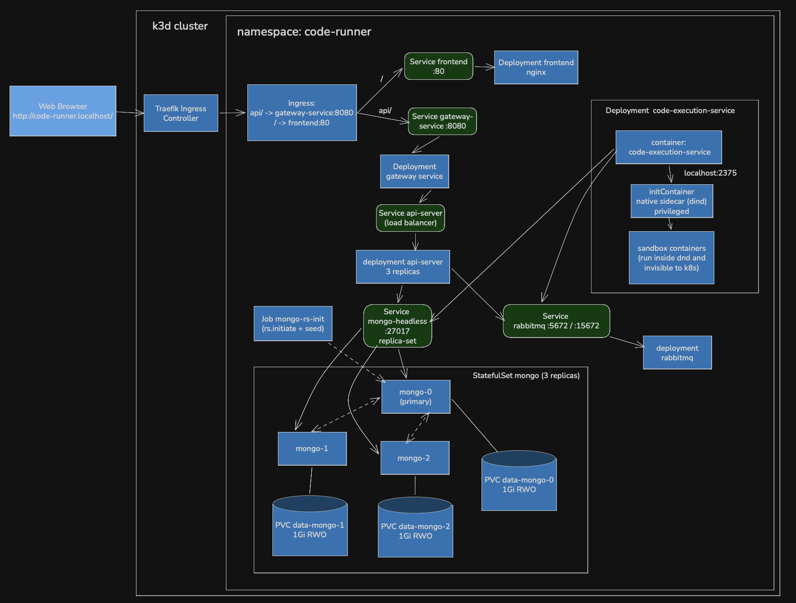

# Code Runner

A web platform where you solve coding problems and get instant feedback - code runs in sandboxed Docker containers on the backend.

The app is a set of containerized services with a MongoDB database, runnable end-to-end either with Docker Compose or on a local Kubernetes cluster (k3d) deployed via Argo CD. CI/CD is handled by GitHub Actions + Argo CD GitOps.

## Architecture


The system splits into a synchronous **request plane** (browser to gateway to API server) and an asynchronous **execution plane** (RabbitMQ to the execution worker to a throwaway sandbox container). See [`diagrams/high-level-arch-diagram.md`](diagrams/high-level-arch-diagram.md) for the mermaid source.

| Component                  | Description                                                                                                                            |
| -------------------------- | -------------------------------------------------------------------------------------------------------------------------------------- |
| **Frontend**               | React app with a CodeMirror editor, light/dark theme, and resizable panels; served as a production build behind nginx                  |
| **Gateway**                | Spring Cloud Gateway that routes `/api/**` to the API Server                                                                            |
| **API Server**             | Handles problems, code submissions, and job status polling; publishes jobs to RabbitMQ. Runs as 3 instances                            |
| **Code Execution Service** | Consumes jobs from the queue, injects user code into a language-specific test harness, and runs it inside a sandboxed Docker container |
| **Common**                 | Shared library (DTOs, Mongo document models, RabbitMQ constants) used by the other backend modules                                     |
| **RabbitMQ**               | Message broker - carries job events between the API Server and the execution worker                                                    |
| **MongoDB**                | The single database. Stores coding problems, test cases, starter templates, and job records (code, timestamps, status, stdout, stderr) |

### Ports (Docker Compose)

| Port    | Service                               |
| ------- | ------------------------------------- |
| `5173`  | Frontend (nginx, mapped from :80)     |
| `8080`  | Gateway                               |
| `5672`  | RabbitMQ (AMQP)                       |
| `15672` | RabbitMQ Management UI                |
| `27018` | MongoDB (mapped from :27017 internally) |

The 3 API Server instances and the Code Execution Service are internal only; the gateway and frontend reach them over the Compose network.

## How it works


The full sequence (submit, queue, sandbox run, result routing, polling) is in [`diagrams/general-flow-sequence-diagram.md`](diagrams/general-flow-sequence-diagram.md).

1. The client sends a `POST /api/submit` with the code, language, and problem ID
2. The API Server saves a `PENDING` job to MongoDB, publishes a `JobCreatedEvent` to the RabbitMQ work queue, and immediately returns `202 Accepted` with a `job_id`
3. The client starts polling `GET /api/status/{job_id}` every second
4. The Code Execution Service picks up the event, fetches the problem's test cases from MongoDB, loads the matching harness template (`python-harness.py` or `js-harness.js`), and injects the user's code + test cases into it
5. The composed script runs inside a throwaway Docker container (`python:3.10-slim` / `node:18-slim`) with strict limits:
   - 100 MB memory, no swap
   - 0.5 CPU cores, 50 PIDs max
   - No network access, read-only filesystem
   - Non-root user, 5-second timeout
6. stdout/stderr are captured, the job is persisted to MongoDB as `COMPLETED` or `FAILED`, and a `JobStatusEvent` is routed back to the originating API Server instance via its per-instance RabbitMQ reply queue
7. The next poll from the client picks up the finished result. Status is served from an in-memory store first, falling back to MongoDB when the poll lands on a different instance

## Running it

There are two ways to run the whole stack: **Docker Compose** (simplest) and **Kubernetes on k3d** (GitOps via Argo CD).

### Prerequisites

- Docker
- For the Kubernetes path: `k3d` and `kubectl`

No local Java, Node, or database installs are needed. Every service builds inside its own container.

### Option 1: Docker Compose

From the repo root:

```bash
docker compose up --build
```

This builds and starts everything: frontend, gateway, 3 API Server replicas, the execution service, RabbitMQ, and MongoDB. A few things happen automatically:

- MongoDB is seeded once on first start from `mongo-init/` (the included problem set)
- The execution service mounts the host Docker socket and builds the `python-coderunner-image` / `javascript-coderunner-image` sandbox images on startup if they are missing
- The gateway routes `/api/**` to the `api-server` service; Docker DNS round-robins across the 3 replicas

Once it is up, open [http://localhost:5173](http://localhost:5173).

### Option 2: Kubernetes with k3d

The whole cluster, including Argo CD, is stood up by a single script. From the repo root:

```bash
# 1. provide real credentials (the secret is gitignored, not managed by GitOps)
cp k8s/secret.example.yaml k8s/secret.yaml
# edit k8s/secret.yaml and fill in the Mongo / RabbitMQ / replica-set-key values

# 2. bring up the cluster
./commands/bootstrap.sh
```

`bootstrap.sh` is re-runnable (it deletes and recreates the cluster) and does the following:

1. (re)creates a k3d cluster with Traefik published on localhost `:80`/`:443`
2. creates the `code-runner` namespace and applies the bootstrap secret out-of-band
3. installs Argo CD into the `argocd` namespace and enables Helm support in its kustomize build (for the Bitnami MongoDB chart)
4. registers the Argo CD `Application`, which deploys the app from the `k8s/` path of the **`dev` branch on GitHub** (true GitOps, not your local working tree)
5. waits for the application to become Synced + Healthy, then prints access info



Inside the `code-runner` namespace (see the diagram above):

- A Traefik **Ingress** on `code-runner.localhost` routes `/api` to the gateway Service and `/` to the frontend Service
- The **api-server** Service load-balances 3 Deployment replicas (replacing the Compose DNS round-robin)
- MongoDB runs as a **3-member replica set** (Bitnami Helm chart, rendered into a StatefulSet with a PVC per replica)
- The **code-execution-service** runs a privileged `docker:dind` native sidecar and talks to it via `DOCKER_HOST=tcp://localhost:2375`, so sandbox containers run inside dind instead of needing the host socket

When the script finishes, open [http://code-runner.localhost/](http://code-runner.localhost/). On macOS `*.localhost` resolves automatically; on Linux add `127.0.0.1 code-runner.localhost` to `/etc/hosts`.

Handy day-to-day commands (cluster, Argo CD, image bumps, Mongo access) live in [`commands/useful-commands.md`](commands/useful-commands.md).

## CI/CD


CI/CD is GitHub Actions for build and Argo CD for deploy (see [`diagrams/gitops-diagram.md`](diagrams/gitops-diagram.md)):

- **`.github/workflows/ci.yml`** runs a `validate` job (Maven compile gate) and a `build-images` job (a matrix over the 4 services).
- On a plain push to `dev` the images are **built only** (single-arch, no push) to verify the Dockerfiles still build.
- On a `v*` tag the images are built **multi-arch** (amd64 + arm64) and pushed to DockerHub (`gavro081/code-runner-*`). The tag is the single deployable source of truth.
- **Argo CD** watches the `dev` branch and the `k8s/` path and auto-syncs to the cluster (automated sync with prune + self-heal). The image tag deployed lives once in `k8s/kustomization.yaml`.

## Project structure

```
api-server/                        # REST API + job creation (runs 3 instances)
code-execution-service/            # Worker: Docker-based sandboxed execution
  └─ src/main/resources/
      ├─ docker/                   # Dockerfiles for Python & JS runner images
      └─ templates/                # Test harness templates (python-harness.py, js-harness.js)
gateway-service/                   # Spring Cloud Gateway
common/                            # Shared models, events, and RabbitMQ config
frontend/                          # React + Vite + CodeMirror + Tailwind CSS (nginx for prod)
mongo-init/                        # MongoDB seed script (Compose)
docker-compose.yml                 # Full stack for local Docker Compose
k8s/                               # Kubernetes manifests (kustomize + Bitnami MongoDB chart)
argocd/                            # Argo CD Application (GitOps)
.github/workflows/                 # CI pipeline (ci.yml)
commands/                          # bootstrap.sh + a useful-commands reference
diagrams/                          # Architecture, flow, and GitOps diagrams
```

## Tech stack

| Layer      | Tech                                                           |
| ---------- | -------------------------------------------------------------- |
| Frontend   | React 19, TypeScript, Vite, Tailwind CSS, CodeMirror, nginx    |
| Gateway    | Spring Cloud Gateway                                           |
| API        | Spring Boot, Spring Data MongoDB, Spring AMQP                  |
| Execution  | Docker Java SDK, sandboxed containers                          |
| Messaging  | RabbitMQ (topic exchange, per-instance reply queues)           |
| Storage    | MongoDB (problems, test cases, and jobs)                       |
| Build/CI   | GitHub Actions, DockerHub                                      |
| Deploy     | Docker Compose, Kubernetes (k3d), kustomize, Argo CD (GitOps)  |

## License

[MIT](LICENSE)
