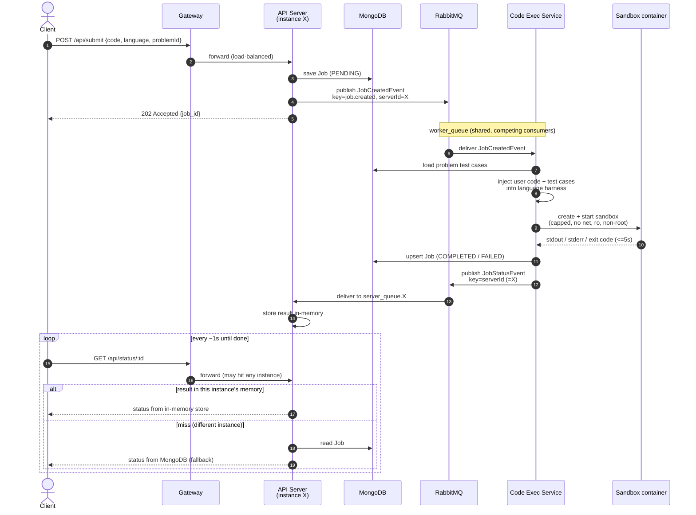

```mermaid
sequenceDiagram
    autonumber
    actor C as Client
    participant G as Gateway
    participant A as API Server<br/>(instance X)
    participant DB as MongoDB
    participant MQ as RabbitMQ
    participant W as Code Exec Service
    participant S as Sandbox container

    C->>G: POST /api/submit {code, language, problemId}
    G->>A: forward (load-balanced)
    A->>DB: save Job (PENDING)
    A->>MQ: publish JobCreatedEvent<br/>key=job.created, serverId=X
    A-->>C: 202 Accepted {job_id}

    Note over MQ,W: worker_queue (shared, competing consumers)
    MQ->>W: deliver JobCreatedEvent
    W->>DB: load problem test cases
    W->>W: inject user code + test cases<br/>into language harness
    W->>S: create + start sandbox<br/>(capped, no net, ro, non-root)
    S-->>W: stdout / stderr / exit code (<=5s)
    W->>DB: upsert Job (COMPLETED / FAILED)
    W->>MQ: publish JobStatusEvent<br/>key=serverId (=X)
    MQ->>A: deliver to server_queue.X
    A->>A: store result in-memory

    loop every ~1s until done
        C->>G: GET /api/status/:id
        G->>A: forward (may hit any instance)
        alt result in this instance's memory
            A-->>C: status from in-memory store
        else miss (different instance)
            A->>DB: read Job
            A-->>C: status from MongoDB (fallback)
        end
    end
```