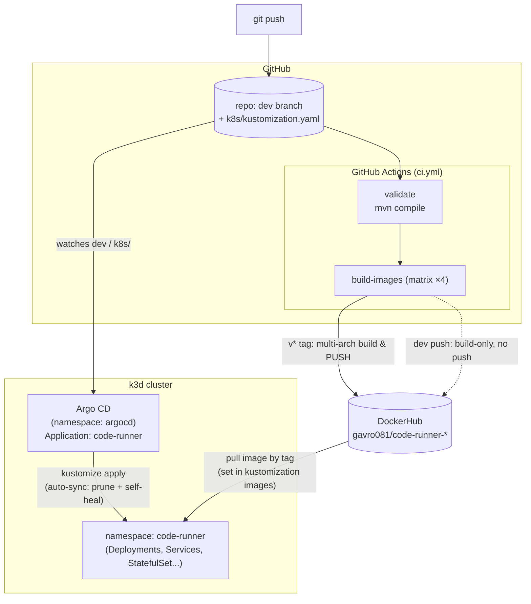

```mermaid
flowchart TB
    dev["git push"]

    subgraph gh["GitHub"]
        repo[("repo: dev branch<br/>+ k8s/kustomization.yaml")]
        subgraph ci["GitHub Actions (ci.yml)"]
            val["validate<br/>mvn compile"]
            bld["build-images (matrix &times;4)"]
        end
    end

    hub[("DockerHub<br/>gavro081/code-runner-*")]

    subgraph cluster["k3d cluster"]
        argo["Argo CD<br/>(namespace: argocd)<br/>Application: code-runner"]
        nsapp["namespace: code-runner<br/>(Deployments, Services, StatefulSet...)"]
    end

    dev --> repo
    repo --> val --> bld
    bld -->|"v* tag: multi-arch build & PUSH"| hub
    bld -.->|"dev push: build-only, no push"| hub

    repo -->|"watches dev / k8s/"| argo
    argo -->|"kustomize apply<br/>(auto-sync: prune + self-heal)"| nsapp
    hub -->|"pull image by tag<br/>(set in kustomization images)"| nsapp
```