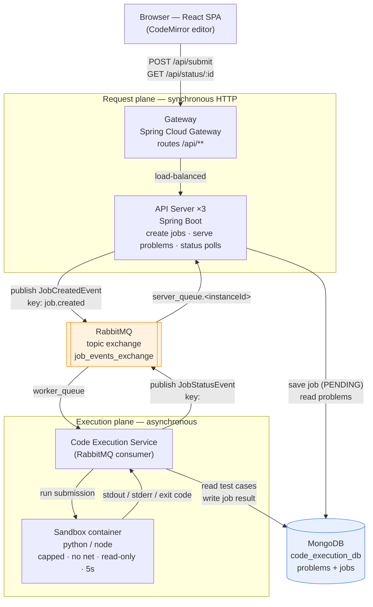

```mermaid
flowchart TB
    browser["Browser — React SPA<br/>(CodeMirror editor)"]

    subgraph req["Request plane — synchronous HTTP"]
        direction TB
        gw["Gateway<br/>Spring Cloud Gateway<br/>routes /api/**"]
        api["API Server &times;3<br/>Spring Boot<br/>create jobs · serve problems · status polls"]
    end

    subgraph exec["Execution plane — asynchronous"]
        direction TB
        ces["Code Execution Service<br/>(RabbitMQ consumer)"]
        sandbox["Sandbox container<br/>python / node<br/>capped · no net · read-only · 5s"]
    end

    mq[["RabbitMQ<br/>topic exchange<br/>job_events_exchange"]]
    mongo[("MongoDB<br/>code_execution_db<br/>problems + jobs")]

    browser -->|"POST /api/submit<br/>GET /api/status/:id"| gw
    gw -->|load-balanced| api
    api -->|"save job (PENDING)<br/>read problems"| mongo
    api -->|"publish JobCreatedEvent<br/>key: job.created"| mq

    mq -->|"worker_queue"| ces
    ces -->|"read test cases<br/>write job result"| mongo
    ces -->|"run submission"| sandbox
    sandbox -->|"stdout / stderr / exit code"| ces
    ces -->|"publish JobStatusEvent<br/>key: <serverId>"| mq
    mq -->|"server_queue.&lt;instanceId&gt;"| api

    classDef store fill:#e8f0fe,stroke:#4285f4;
    classDef broker fill:#fff3e0,stroke:#fb8c00;
    class mongo store;
    class mq broker;
```